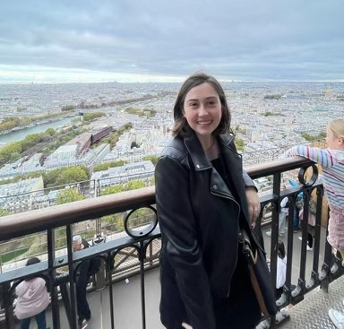

# Mary Cannon

🎓 **Undergraduate Student | University of Notre Dame**  
📊 **Majoring in Applied Computational Mathematics and Statistics**  
🧠 **Minoring in Data Science | Interested in Public Health Applications**

---

## 👋 About Me  
I am an undergraduate student passionate about applying data science techniques to solve real-world problems, especially in the public health sector. My academic background combines statistical reasoning, computational tools, and machine learning to explore and visualize meaningful data-driven insights.

---

## 🧠 Skills & Tools
- **Languages:** Python (Pandas, NumPy, scikit-learn), R  
- **Tools:** Streamlit, Tableau, Microsoft Excel, Git/GitHub  
- **Techniques:** Data Cleaning, Data Visualization, Supervised & Unsupervised Machine Learning  
- **Collaboration:** Experienced with version control and reproducible research practices  

---

## 📂 Featured Projects
- 🔍 [Basic Data Filtering Streamlit App – Penguin Data Explorer](https://github.com/Mcannon3/CANNON-Data-Science-Portfolio/tree/main/basic_streamlit_app)  
  An interactive app for exploring penguin data through filters and summary statistics.

- 🏅 [Tidy Data Project – Olympic Medalists](https://github.com/Mcannon3/CANNON-Data-Science-Portfolio/tree/main/TidyData-Project)  
  Cleaned and transformed Olympic data to follow tidy data principles and created visual summaries.

- 🤖 [Supervised ML App](https://github.com/Mcannon3/CANNON-Data-Science-Portfolio/tree/main/MLStreamlitApp)  
  Built a Streamlit application for applying classification models with hyperparameter tuning.

- 🔎 [Unsupervised ML App](https://github.com/Mcannon3/CANNON-Data-Science-Portfolio/tree/main/UnsupervisedMLApp)  
  Interactive tool for exploring clustering and dimensionality reduction techniques on custom datasets.

---

## 🎯 Current Goals
- Strengthen my understanding of machine learning theory and practice  
- Expand visualization skills using Tableau  
- Continue building and deploying interactive data science tools  

---

## 📫 Contact
📧 Email: [mcannon3@nd.edu](mailto:mcannon3@nd.edu)  
🔗 [GitHub Portfolio](https://github.com/Mcannon3/CANNON-Data-Science-Portfolio)
